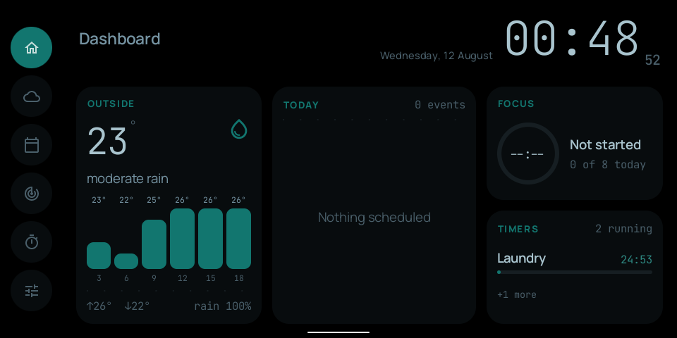
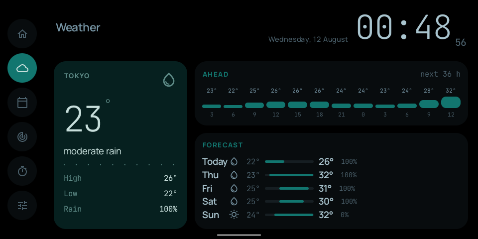
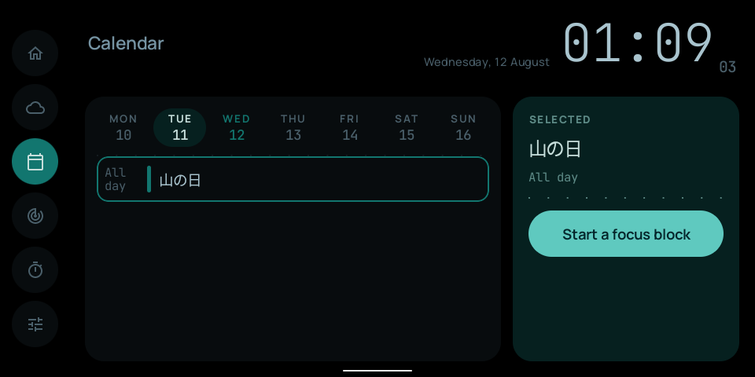
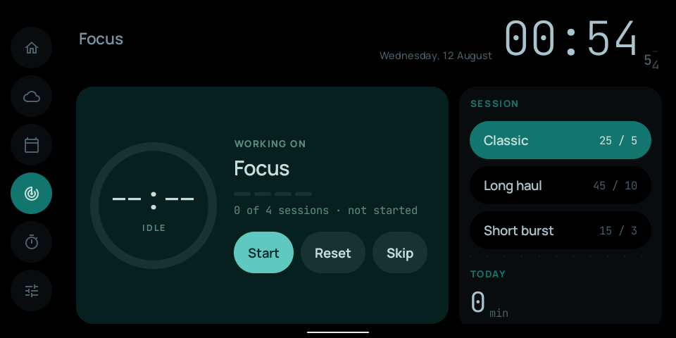
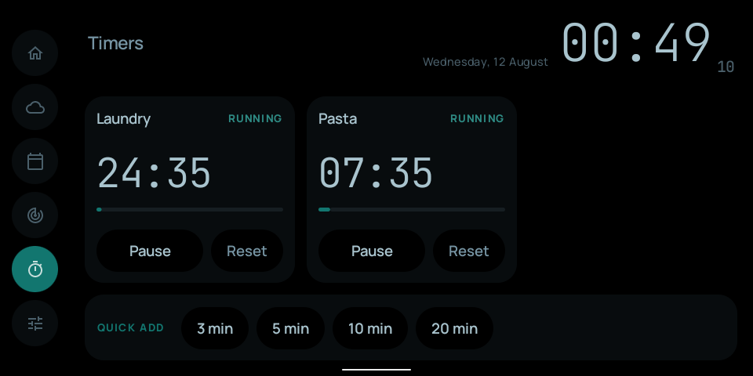
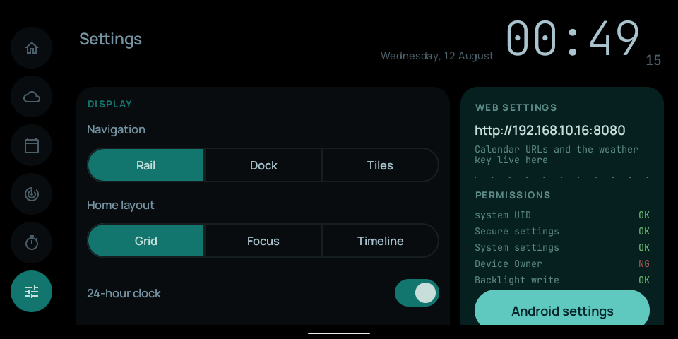

# ShowDeck

[](https://github.com/shsw228/showdeck/actions/workflows/build.yml)

Android 化した Amazon Echo Show 5（第 2 世代 / `cronos`）を、常駐ダッシュボードに変える Android アプリ。



## できること

- **時計** — 分は 1 桁ずつ転がし、秒は等幅の数字で添える
- **天気** — OpenWeatherMap の現況と 5 日予報。地点は座標指定か現在地から
- **カレンダー** — ICS（`webcal`）の購読。複数 URL、繰り返しと除外日に対応
- **ポモドーロ** — 長さのプリセット、自動継続、今日の合計
- **タイマー** — 同時に 8 本まで。音と読み上げで発報し、無音（画面だけ）も選べる
- **明るさ** — 昼夜で切り替え、照度センサーで消灯と復帰
- **Web 設定画面と JSON API** — 端末内で HTTP を待ち受け、mDNS で名乗る

## 画面

| | |
|---|---|
| **Weather**<br>現況、3 時間刻みの推移、5 日予報 | **Calendar**<br>週ストリップ、予定一覧、選んだ予定から集中を始められる |
|  |  |
| **Focus**<br>ポモドーロ | **Timers**<br>カウントダウンとクイック追加 |
|  |  |
| **Settings**<br>設定、権限の状態、Android の設定への入口 | **Web**<br>同じ設定をブラウザから |
|  | 長い文字列（ICS の URL、API キー）は 5.5 インチでは打てない |

ナビは 3 通り（左レール / 下ドック / タイルのみ）、Home の並べ方も 3 通り選べる。

## 動作環境

| | |
|---|---|
| 端末 | Echo Show 5 2nd gen (2021) / `cronos` |
| OS | LineageOS 18.1 / Android 11 (API 30) `userdebug` `test-keys` |
| 画面 | 960×480、密度 195（≒ 788×394 dp）|
| ABI | `armeabi-v7a`（ROM が 32bit）|
| minSdk / targetSdk / compileSdk | 28 / 28 / 37 |

**ROM が AOSP の公開テスト鍵で署名されていることが前提。** 同じ鍵で APK を署名し
`sharedUserId=android.uid.system` を宣言することで、root なしで system UID を得ている。
バックライトの直接制御と signature 権限はこれが土台。

## セットアップ

### 1. 開発環境

```sh
brew install openjdk@17
brew install --cask android-platform-tools android-commandlinetools

export JAVA_HOME=/opt/homebrew/opt/openjdk@17
export ANDROID_HOME="$HOME/Library/Android/sdk"
sdkmanager --sdk_root="$ANDROID_HOME" "platform-tools" "platforms;android-37.1" "build-tools;37.0.0"
```

`local.properties` に `sdk.dir` を書く。Gradle は Wrapper で固定してある。

### 2. 端末の確認

```sh
./scripts/check-device.sh   # 何も変更しない
```

SoC・RAM・画面密度・ABI・バックライトの sysfs パスが出る。

### 3. 署名鍵

```sh
./scripts/fetch-platform-keys.sh
```

AOSP の公開テスト鍵を取得し、端末の署名とフィンガープリントを照合して
`keys/platform.p12` を作る。鍵はリポジトリに含めていない。

**これを実行しないとビルドした APK はインストールできない。**

### 4. インストール

```sh
./gradlew installRelease
./scripts/setup-device.sh
```

### 5. Device Owner（任意）

```sh
adb shell dpm set-device-owner com.shsw228.showdeck/.admin.AdminReceiver
```

ホームアプリの固定に使う。付けなくてもアプリは動く。端末にアカウントが
1 つでも登録されていると失敗する。

**Device Owner が付いているとアンインストールできない。**
外す手順は [docs/design.md](docs/design.md) にある。

### 戻す

```sh
./scripts/revert-device.sh
```

## 使い方

| 操作 | 動作 |
|---|---|
| ナビ | Home / Weather / Calendar / Focus / Timers / Settings を切り替える |
| タイルをタップ | その画面へ移動する |
| 画面をタップ | 消灯中なら一時的に戻す / 発報中なら止める |
| 音量キー | アラームの音量。自前のインジケータか `SystemUI` の音量パネルを選べる |

既定のホームアプリにするかは Settings タブの `Home app` から。Android の選択
ダイアログはインストール時ではなく HOME キーを押したときに出るので、設定から
開けるようにしてある。

## 設定

端末の **Settings タブ**で大半は変えられる。長い文字列は Web から。

```
http://<端末の IP>:8080
```

- 天気の座標と地点名、OpenWeatherMap の API キー
- ICS の URL（改行区切りで複数）
- 夜間モードの時間帯、バックライトの値、消灯の設定
- ポモドーロの長さ、アラーム時刻
- `logcat` の閲覧

**認証は無い。宅内 LAN の外に出さないこと。** このアプリは system UID で動くので、
無認証で置く危険は通常のアプリより大きい。

API キーは Android Keystore の鍵で暗号化して端末内に置く。リポジトリにも APK にも
入っていない。ログにも伏せ字しか出ない。

## CLI と API

DNS-SD で名乗るので IP を覚えなくても引ける（`_http._tcp.` / 名前は `ShowDeck`）。
`NsdManager` が広告できるのはサービス名だけなので、名前解決の結果は端末側の
ホスト名になる。`scripts/showdeck` がその解決を代わりにやる。

```sh
./scripts/showdeck host                 # http://Android-2.local:8080
./scripts/showdeck state                # いまの状態を JSON で
./scripts/showdeck pomodoro start       # start | pause | skip | stop
./scripts/showdeck timer 3 tea          # 3 分のタイマーを "tea" で
./scripts/showdeck timer-toggle <id>    # 一時停止と再開
./scripts/showdeck timer-reset <id>     # 頭に戻す
./scripts/showdeck timer-remove <id>    # 一覧から消す
./scripts/showdeck stop                 # 鳴っている発報を止める
```

状態を変える操作は POST だけで受ける。

## 開発

```sh
./gradlew testDebugUnitTest                 # ユニットテスト
./gradlew lintRelease                       # lint
./gradlew assembleRelease                   # R8 を通した APK
./gradlew :app:updateDebugScreenshotTest    # UI を変えたら参照画像を撮り直す
./gradlew :app:validateDebugScreenshotTest  # 参照画像と比べる
```

GitHub Actions が push と PR で `testDebugUnitTest lintDebug assembleDebug` を回す。
ドキュメントだけの変更では走らない。CI は署名鍵を持たないので release は回さない。

## 同梱物

| | |
|---|---|
| [Manrope](https://github.com/sharanda/manrope) | SIL Open Font License 1.1 — [notice](third_party/fonts/OFL-Manrope.txt) |
| [JetBrains Mono](https://github.com/JetBrains/JetBrainsMono) | SIL Open Font License 1.1 — [notice](third_party/fonts/OFL-JetBrainsMono.txt) |

このリポジトリ自体のライセンスは未設定（既定では著作権者に全権が留保される）。

## 詳しい話

判断の理由と実機での実測値は [docs/design.md](docs/design.md) にある。寸法の決め方、
バックライトの押し戻し、ICS のどこまで対応しているか、`SystemUI` を止めなかった理由、
CPU とメモリの測定値など。
